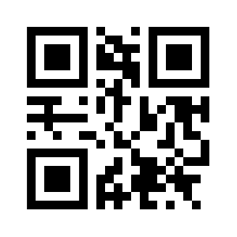

# Remote Operated Vehicle (ROV)

This folder contains the code for the ROV Robot. The code is split into two folders, one for the Arduino and another for the Raspberry Pi.

## Arduino

The `Arduino` folder contains the microcontroller code for controlling the motors of the ROV.

## Raspberry Pi

The `Raspberry Pi` folder contains the code for handling the camera, lights, network communications, and issuing commands to the Arduino drive train controller.

## QR code authentication

Below here is the QR Code used by the mobile app to scan and connect to the ROV.

